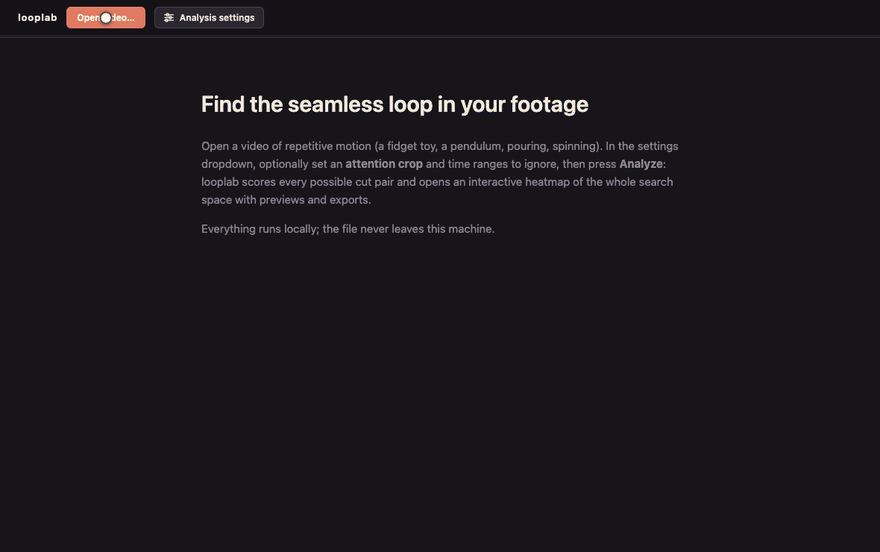
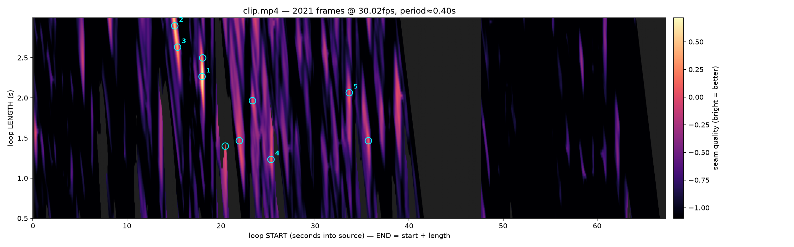

# looplab

Find the most seamless loop hidden in a video of repetitive motion — and cut it, frame-exact.

```bash
looplab input.mp4        # → input.loop.mp4, the best wrap point in the footage
```



Point it at footage of anything cyclic — a fidget toy, a pendulum, pouring, spinning, kneading — and looplab scores **every possible (start, end) cut pair** for how invisibly the video can wrap from its last frame back to its first, then renders the winner.



Every pixel above is one candidate loop (start time × loop length); bright ridges are cuts that flow. looplab finds them exhaustively, not by sampling — the interactive version of this map (`--explore`) lets you scrub and preview every one.

## How it works

Frame similarity alone produces loops that *pose* correctly but *pop* on playback — the classic failure is matching two frames where the object is in the same place moving in opposite directions. looplab scores each candidate pair (s, e) with three distance streams, all computed on a small decoded proxy:

- **Position** — variance-weighted RGB distance, so moving regions outvote static background acreage.
- **Velocity** — central-difference frame derivatives, penalizing pose-matches with mismatched motion.
- **Focus** — luma masked to bright, low-saturation pixels: the moving prop in typical fidget footage. This is what catches "same hands, different toy configuration." Content-specific by design; `--focus-weight 0` disables it.

Each stream is evaluated over a **±K-frame window along the seam diagonal** (comparing s+k against e+k), so the motion must flow through the cut, not just match at it. Two gates then remove degenerate winners:

- **Activity** — a frozen or occluded stretch loops "perfectly" and shows nothing; loops must contain real motion relative to the video's median.
- **Disruption exclusion** — sustained framing anomalies (camera bumps, subject leaving frame) are auto-detected via MAD z-scores against the temporal median frame and excluded, while brief motion-blur spikes are kept as legitimate content.

The search is exhaustive over a **banded (start × length) space** — every start frame × every loop length within `[--min-loop, --max-loop]`. Cost is one video decode plus one banded distance computation, `O(N · B · d)`: a minute of 30 fps video is ~150k scored pairs and runs in seconds.

**Backends** — picked automatically, forceable with `LOOPLAB_BACKEND=mlx|cupy|numpy`:

- **MLX** — Apple Silicon GPU via unified memory. Developed and tested here.
- **CUDA via CuPy** — NVIDIA GPUs (`pip install 'looplab[nvidia]'`). *Designed in but currently untested on real hardware*: CuPy shares the numpy code path verbatim (same array API), which is verified, but no CUDA device has run it yet — reports and fixes welcome. On ≤8 GB cards use `--proxy-long 256` to fit the working set.
- **numpy** — runs everywhere, same results, just slower.

## Install

Requires `ffmpeg`/`ffprobe` on PATH, Python ≥ 3.10.

```bash
pip install 'looplab[all] @ git+https://github.com/shihanqu/looplab'
# or minimal (numpy only, no explorer):
pip install 'looplab @ git+https://github.com/shihanqu/looplab'
```

Extras: `mlx` (Apple Silicon acceleration; skipped automatically on other platforms), `nvidia` (CuPy/CUDA 12 — untested, see Backends above), `explorer` (interactive heatmap UI, strips, heatmap.png).

## CLI

```bash
looplab input.mp4                     # best loop → input.loop.mp4
looplab input.mp4 -o perfect.mp4      # name the output
looplab input.mp4 --json              # machine-readable result on stdout
looplab input.mp4 --render-top 3      # also render ranks 2–3 into the workdir
looplab input.mp4 --explore           # + interactive heatmap explorer
```

Logs go to stderr; stdout carries only the output path (or JSON). Analysis artifacts — `scores.npz`, `candidates.json`, rendered extras — land in `<input>.looplab/`.

| Flag | Default | Meaning |
|---|---|---|
| `--min-loop` / `--max-loop` | 0.5 / 3.0 | loop length band, seconds |
| `--window` | 5 | ± frames matched across the seam |
| `--vel-weight` | 1.0 | velocity stream weight |
| `--focus-weight` | 1.0 | bright-object stream weight (0 = off) |
| `--min-activity` | 0.7 | min in-loop motion vs video median |
| `--proxy-long` | 512 | proxy resolution; lower = faster |
| `--crf` | 18 | x264 quality of rendered loops |

## The explorer

```bash
looplab --ui                 # open the explorer, pick a video with the OS file dialog
looplab input.mp4 --ui       # same, pre-loading this video
```

`--ui` starts a localhost-only server and opens the explorer in your browser. **Open video…** raises the native OS file picker (macOS `choose file`, tkinter elsewhere) — the server gets a real filesystem path and analyzes the original in place, no upload or copy; live progress streams into the toolbar. The explorer itself is a heatmap of the entire search space: hover to scrub any (start, end) pair with a magnetic cursor that snaps to ridge peaks, click any cell for an instant in-page segment preview, and one-click export the top cuts.

For a no-server snapshot, `--explore` writes the same UI as static files into the workdir: `index.html` (full-quality previews for the top 10) and `artifact.html` (single-file, videos embedded as data URIs — postable anywhere a strict CSP applies).

## For agents

looplab is built to be driven headless — see [SKILL.md](SKILL.md) for the full contract. Short version:

```bash
looplab input.mp4 --json --quiet
```

```json
{"ok": true, "output": "input.loop.mp4",
 "chosen": {"start_frame": 540, "end_frame": 608, "len_s": 2.265,
            "score": 0.489, "percentile": 0.0, "activity": 1.09},
 "candidates": ["… top 10, same shape …"]}
```

Exit codes: `0` success · `2` nothing survived the gates (relax `--min-activity`, widen the band) · `3` missing dependency · `4` unreadable input.

## Capture tips & limitations

Static camera, single continuous shot, locked exposure if possible. Perform **many repetitions**: each pair of cycles is another lottery ticket for the object landing in the same state twice, and candidate count grows quadratically with cycles. The focus stream assumes a bright, unsaturated subject; disable or reweight it for other footage. VFR phone video is handled by frame-index cutting with CFR re-stamping at the average rate.

## License

MIT
